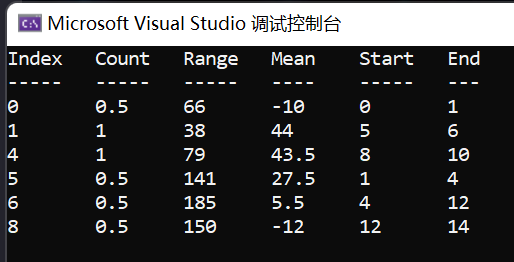
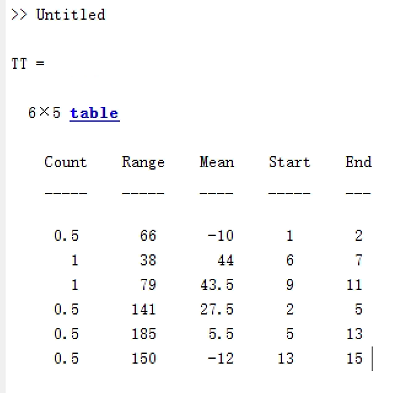
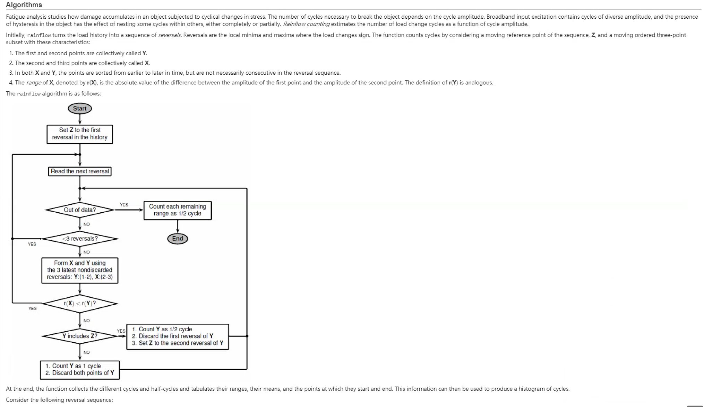
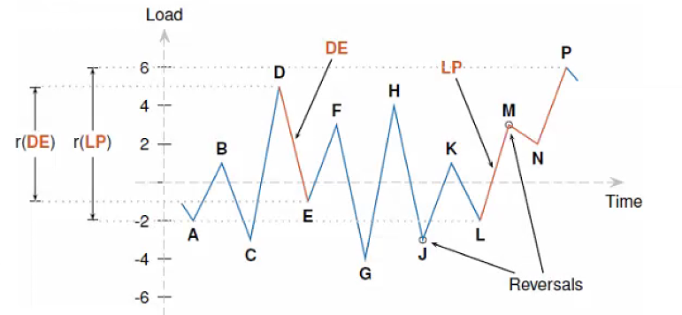
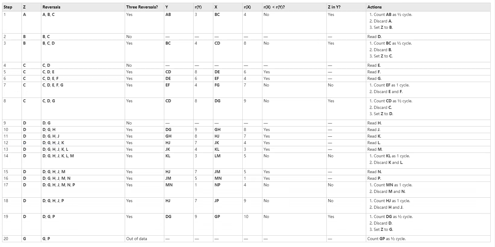

## example 

```c#
static void Main(string[] args)
{
    var data = new List<float>() { 23, -43, 56, 78, 98, 25, 63, 41, 4, 6, 83, 25, -87, 41, 63 };

    RainFlow rainFlow = new RainFlow();
    var res = rainFlow.Apply(data);

    Console.WriteLine(res);
}
```




## compare with matlab

```matlab
data=[23, -43, 56, 78, 98, 25, 63, 41, 4, 6, 83, 25, -87, 41, 63];

[c,hist,edges,rmm,idx] = rainflow(data);

TT = array2table(c,'VariableNames',{'Count','Range','Mean','Start','End'})
```



## algrithm





