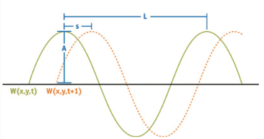

## 1.波浪参数

- 波长L：波峰到波峰之间距离，波频率：$\omega=\frac{2\pi}{L}$
- 波幅A：波面到波峰的高度
- 速度S：波峰移动的速度。可用相位$\phi$表示
- 方向D：波峰移动的水平向量

每个波的状态为：
$$
W_i(x,y,t)=A_i sin(D_i(x,y)\omega_i+t\phi_i)
$$

所有波的求和为：
$$
H(x,y,t)=\sum (A_i sin(D_i(x,y)\omega_i+t\phi_i))
$$

- 可在一定范围内随机生成这些波浪参数
- 亦可以：利用我之前写的matlab脚本，根据波浪谱，基于能量等分法，生产这些参数

