## 小地图（雷达）
- 用于显示周围环境信息
- 一般为俯视视角
- 小地图以被跟踪对象（主角）为中心
- 可用图标来代替被跟踪对象的真实模型


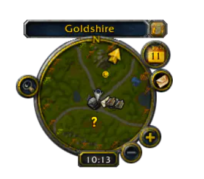
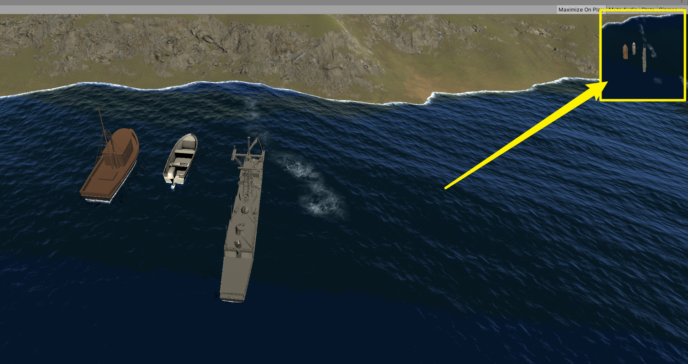

## 实现步骤：
### 1.另创建一个camera
- 常命名为“miniMapCamera”
- 用于小地图的画面拍摄
- 适当调整此相机与被跟踪物体的相对位置

### 2.渲染到UI层
- 创建**Render Texture**
- 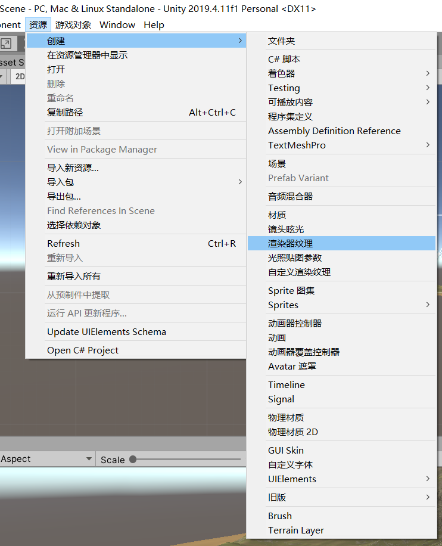
- 常命名为“miniMapCamera Render Texture”
- 选中miniMapCamera，在检视面板将Target Texture设置为刚创建的miniMapCamera Render
- 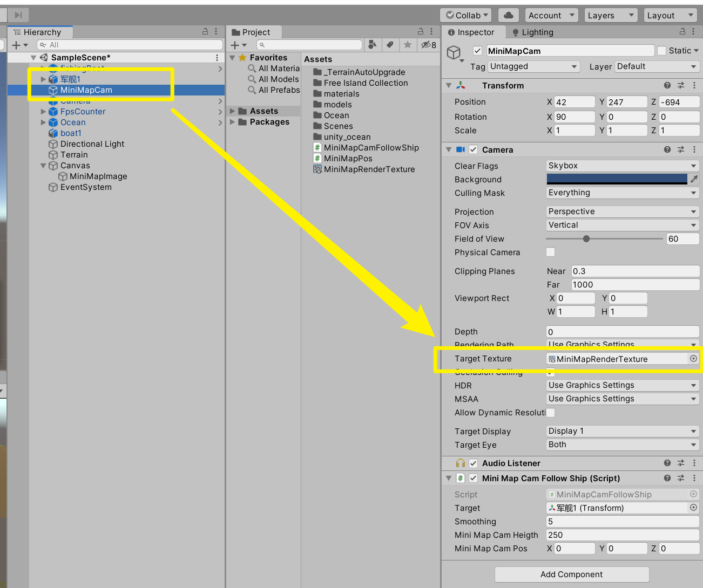


### 3.新建Canvas并添加ui元素
- 新建Canvas
  - 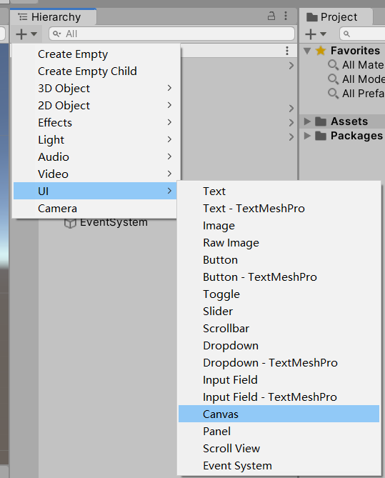
- 新建Raw Image
  - 使用Raw Image在Canvas中显示Render Texture的内容
  - 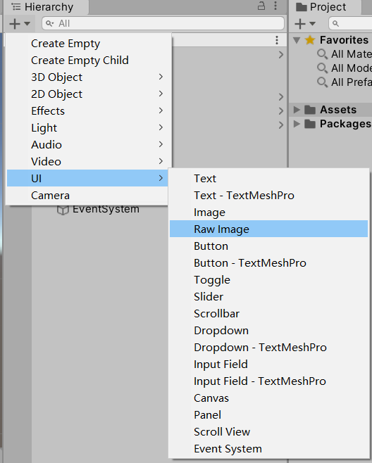
  - 常命名为“miniMapImage”
  - 在Raw Image的检视面板面板中将Texture设为上一步创建的miniMapCamera Render Texture
  - 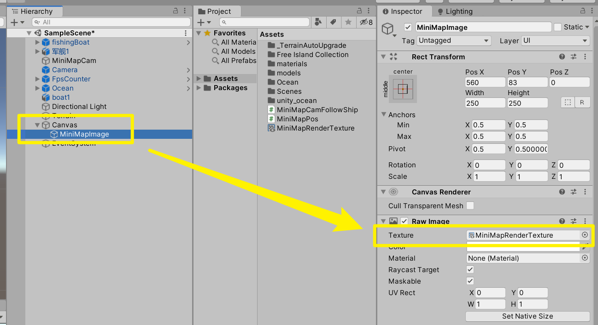

### 4.出现小地图
- 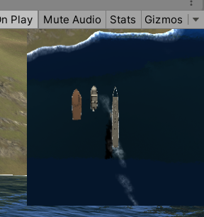


---


## 改进
### 1.小地图跟踪对象
- 经过上述设置后虽然出现了小地图，也能正常显示，但小地图永远只显示摄像机拍到的区域，换言之摄像机是静态的
- 应该实现为摄像机跟随对象，小地图以被跟踪对象为中心

```c#
public class MiniMapCamFollowShip : MonoBehaviour
{
        // 此脚本挂载于 MiniMapCam 小地图摄像机上
        // 实现：
        // 1.小地图实时跟随被跟踪物体（船)
        // 2.调节相机的垂直高度

        public Transform target;            // 被跟踪物体目标
        public float smoothing = 5f;        // 相机跟踪速度
        public float miniMapCamHeigth=250;  // 小地图摄像机的高度
        public Vector3 miniMapCamPos;       // 相机位置

    void FixedUpdate ()
    {
        // 获取跟踪目标的位置
        miniMapCamPos = target.transform.position;
        // 再更改高度y
        miniMapCamPos.y = miniMapCamHeigth;
        // 刷新摄像机的position
        this.transform.position = Vector3.Lerp (transform.position, miniMapCamPos, smoothing * Time.deltaTime);
    }
}
```

### 2.小地图贴边固定
- 经过上述步骤，小地图得到完善，但是当全屏试玩游戏，或者打包游戏全屏运行时发现，小地图的位置并没有出现在我人为在画布中固定的位置
- 需要实现将小地图固定在屏幕中某一位置，右上角之类的

```c#
public class MiniMapPos : MonoBehaviour
{
    public Vector3 anchorPos;           // 小地图要固定的位置
    public float miniMapWidth;          // 实现正方形的小地图，仅宽度就行

    void Start()
    {
        miniMapWidth = 250f;
    }
    void Update()
    {
        anchorPos.x = Screen.width- miniMapWidth/2;     // 获取屏幕宽度 减去 小地图中心点与小地图边缘的距离
        anchorPos.y = Screen.height- miniMapWidth/2;
        anchorPos.z = 0;        // image没有宽度
        this.transform.position = anchorPos;    // 刷新其位置
    }
}
```

- 其中miniMapWidth设为自己设置的小地图宽度
  - 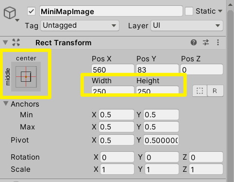
- 注意小地图的中心设置
  - 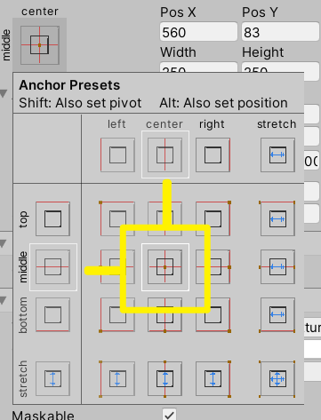


###　３．小地图圆形遮罩或加边框
- 新建Image命名为“maskImage”
- 为其添加mask组件
- 将Image的Source Image设为一个遮罩图片
  - 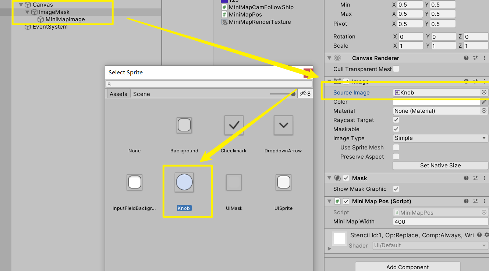

- 将创建的miniMapImage设为maskImage的子对象


