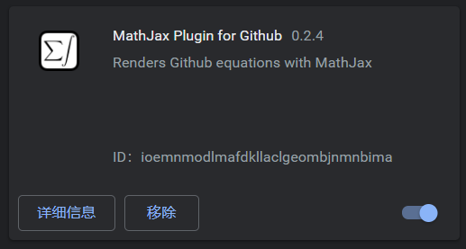
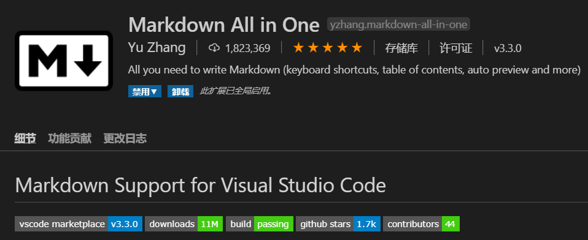
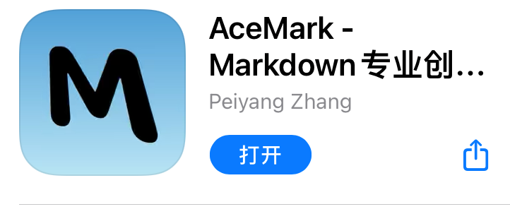

# 1.关于本Repo
- 学习中重要知识总结，以便后期学习或工作温习。
- 采用markdown格式编写，内嵌latex公式

# 2.如何阅读
- A.在chrome浏览器端：下载此插件，并刷新页面
   - 网页端公式可能无法完整显示，或者不显示，建议采用第二种方法阅读。

- B.本地端：拉取库到本地，并安装VS code，并安装插件：

**或**

下载**Typora**

并在设置中勾选：内联公式

- C.ios端：AceMark

