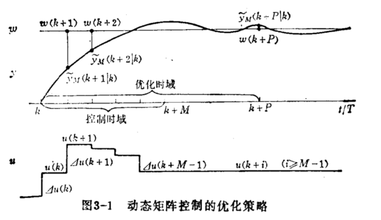

# DMC 动态矩阵控制

特点：
- 基于对象阶跃响应的预测控制算法
- 适用于渐进稳定的线性对象（LTI）
- 对于不稳定系统，可以先使用PID使系统稳定，再使用DMC

算法内容：
- 预测模型
- 滚动优化
- 反馈校正

## 1.预测模型
### 1.1 参数模型
首先需要测定系统对象的单位阶跃响应的采样值$a_i=a(iT)$，$i=1,2,...N$。$T$为采样周期，需要采样到系统趋于稳定$a_s=a(\infty)=a(NT)$。这样，系统的动态信息就可以可以近似用一个有限的集合$[a_1,a_2,...,a_N]$来表示。$N$为建模时域。

### 1.2 预测模型
基于线性时不变的系统的比例和叠加性质，可以利用系统的动态信息来预测系统对象在未来的输出值。

在第k时刻，假定控制作用保持不变时对未来$N$个时刻的输出有初始预测值$\hat{h}(k+i|k),i=1,2,...,N$，当$k$时刻控制输入出现一个增量$\Delta u(k)$时，可以算出在控制增量作用下系统未来时刻的输出值：

$$
\hat{y}_1(k+i|k)=\hat{y}_0(k+i|k)+a_i\Delta u(k), i=1,2,...,N
$$

若在$K$时刻有$M$个连续的控制增量$\Delta u(k),...,\Delta u(k+M-1)$作用下的系统未来时刻的输出值为（预测模型）：

$$
\hat{y}_M(k+i|k)=\hat{y}_0(k+i|k)+\sigma_{j=1}^{min(M,i)}a_{i-j+1} \Delta u(k+j-1),i=1,...,N    \tag{1}
$$

显然：在任意$k$时刻，只要知道了系统对象输出的初始预测值$\hat{y}_0(k+i|k)$，就可以根据未来的控制增量由预测模型(式1)计算系统对象的未来的输出。

## 2.滚动优化
DMC是一种以优化确定控制策略的算法。

其在时刻$k$，要确定从此时刻起的$M$个控制增量$\Delta u(k),...,\Delta u(k+M-1)$，使得被控对象在这$M$个控制增量的作用下未来$P$个时刻的输出预测值$\hat{y}_M(k+i|k),i=1,...,p$，尽可能的接近给的的期望值$w(k+i),i=1,...,p$

M---控制时域
P---优化时域

$k$时刻的优化性能指标取为：
$$
min J(k)=\Sigma^P_{i=1} q_i [w(k+i)-\hat{y}_M (k+i|k)]^2+\Sigma_{j=1}^M r_j \Delta u^2(k+j-1)
$$

$q_i,r_j$为权系数

