# 一、绪论
## 1.常见控制方式
开环控制
- 系统的**控制作用不受输出影响**的控制系统
- 在开环控制系统中,输人端与输出端之间,只有信号的前向通道而不存在由输出端到输人端的反馈通路。

**闭环控制**

- 开环控制系统精度不高和适应性不强的主要原因是缺少从系统输出到输入的反馈回路
- 若要**提高控制精度**,就必须**把输出量的信息反馈到输人端,通过比较输入值与输出值,产生偏差信号**,该偏差信号以一定的控制规律产生控制作用,逐步减小甚至消除这一偏差,从而实现所要求的控制性能
- 系统的**控制作用受输出量影响**的控制系统称闭环控制系统。

优缺点：
- 开环控制系统结构比较简单,成本较低。
- 开环控制系统的缺点是控制精度不高,抑制干扰能力差,而且对系统参数变化比较敏感,一般用于可以不考虑外界影响或精度要求不高的场合,如洗衣机、步进电机控制及水位调节等
- 在闭环控制系统中,不论是输人信号的变化,或者干扰的影响,或者系统内部的变化,只要是被控量偏离了规定值,都会产生相应的作用去消除偏差。因此,闭环控制抑制干扰能力强,与开环控制相比,系统对参数变化不敏感,可以选用不太精密的元件构成较为精密的控制系统,获得满意的动态特性和控制精度。
- 但是采用反馈装置需要添加元部件,造价较高,同时也**增加了系统的复杂性**。如果系统的结构参数选取不适当,控制过程则可能变得很差,甚至出现振荡或发散等不稳定的情况。

## 2.自控系统的基本组成
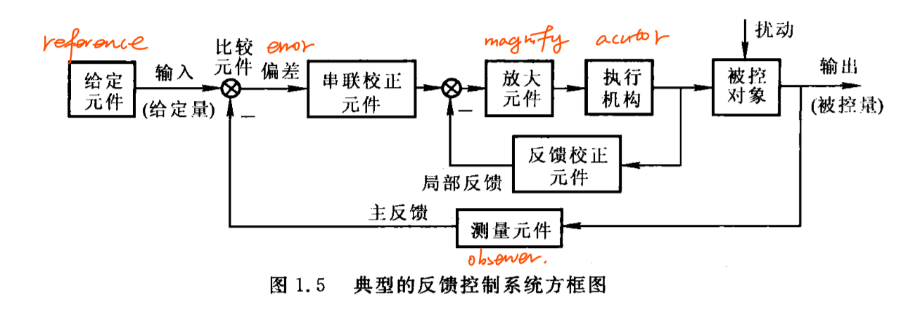


## 3.控制系统的分类
1.按给定信号形式分
- 恒值控制系统：恒值控制系统(也称为定值系统或调节系统）的控制输入是恒定值,要求**被控量保持给定值不变**,例如：液位控制系统、直流电动机调速系统等
- 随动控制系统：随动控制系统(也称为伺服系统)的控制输入是变化规律未知的时间函数,系统的任务是使被控量按同样的规律变化,并与输入信号的误差保持在规定范围内,例如,函数记录仪、自动火炮系统和飞机-自动驾驶仪系统等
- 程序控制系统：程序控制系统的给定信号**按预先编制的程序确定,要求被控量按相应的规律随控制信号变化**，机械加工中的数控机床就是典型的例子

2.定常与非定常

3.线性与非线性

4.连续与离散

5.SISO与MIMO

## 4.系统性能要求
- 实际的物理系统中都存在**惯性元件或者储能元件**，所以系统的**输出量和反馈量总是滞后于输入量的变化**，所以系统达到平衡状态总要经历一定时间。
- 系统初始状态--->最终稳态：过渡过程（瞬态过程）
- 之后：稳态过程
- 性能指标：**稳、准、快**
  - 稳：系统重新恢复平衡状态的能力
  - 准：稳态过程中系统输出量的实际值与期望值之差
  - 快：系统过渡到平衡状态的调节时间短


## 5.研究内容
- 系统分析
- 系统设计

# 二、数学模型
## 1.传递函数
**零初条件**下，LTI系统的**输出量的拉氏变换比上输入量的拉氏变换**。
$$
G(s)=\frac{N(s)}{D(s)}=\frac{b_ms^m+b_{m-1}s^{m-1}+...+b_1s+b_0}{a_ns^n+a_{n-1}s^{n-1}+...+a_1s+a_0}
$$

性质：
- 实际物理系统存在惯性，**分母阶次n总是大于分子阶次m**，$m\leq n$
- 传递函数的拉氏变换为系统的脉冲响应
- 局限在零初条件下，非零初条件下不能使用
- 一般只适用于SISO系统
- 只适用于线性系统

## 2.拉氏变换
### 相关定理
- 线性：$\mathcal{L}[af(t)+bg(t)]=aF(t)+bG(t)$
- 微分：$\mathcal{L}[f^{'}(t)]=sF(s)-f(0)$
- 积分：$\mathcal{L}[\int f(t)dt]=\frac{1}{s} F(s)+\frac{1}{s}f^{-1}(0)$
- 初值：$\lim_{t\to 0}f(t)=\lim_{s \to \infty}sF(s)$
- 终值：$\lim_{t \to \infty}f(t)=\lim_{s\to 0}sF(s)$
- 实位移：$\mathcal{L}[f(t-\tau_0)]=e^{-\tau_0 s}F(s)$
- 虚位移：$\mathcal{L}[e^{At}f(t)]=F(s-A)$

### 留数法
$$
\begin{aligned}
F(s) & =\frac{B(s)}{A(s)}=\frac{b_ms^m+b_{m-1}s^{m-1}+...+b_1s+b_0}{a_ns^n+a_{n-1}s^{n-1}+...+a_1s+a_0}        \\
     & =\frac{(s-z_1)...(s-z_m)}{(s-p_1)...(s-p_n)}   \\
\end{aligned}
$$

- $A(s)=0$无重根时
$$
F(s)=\frac{C_1}{s-p_1}+\frac{C_2}{s-p_2}+...+\frac{C_n}{s-p_n}=\Sigma^n_{i=1}\frac{C_i}{s-p_i}
$$

解$C_i$（两种方法）:
$$
\begin{aligned}
C_i & = \frac{B(s)}{A^{'}(s)}\bigg|_{s=p_i}     \\
C_i & = \lim_{s \to p_i}(s-p_i)F(s)             \\
\end{aligned}
$$

- $A(s)=(s-p_1)(s-p_1)...(s-p_n)=0$有重根时，$p_1$为m重根（$C_m \to C_1$），其余为单根
$$
F(s)=\frac{C_m}{(s-p_1)^m}+\frac{C_{m-1}}{(s-p_1)^{m-1}}+...+\frac{C_1}{s-p_1}+\frac{C_{m+1}}{s-p_{m+1}}+...+\frac{C_n}{s-p_n}
$$

其中$C_{m+1}...C_n$用留数法求

对于$C_m...C_1$:
$$
C_{m-j}=\frac{1}{j!}\lim_{s \to p_1}\frac{d^j[(s-p_1)^mF(s)]}{d s^j}
$$

$$
j:0 \to m-1
$$

## 3.典型环节
|  序号   |  名称 |   微分方程  | 传递函数 |
|:-:|:-:|:-:|:-:|
| 1 | 比例环节 | $c=kr$         | $k$              |
| 2 | 惯性环节 | $T\dot{c}+c=r$ | $\frac{1}{Ts+1}$ |
| 3 | 振荡环节 | $T^2\ddot{c}+2\xi Ts+1=r,0<\xi<1$ | $\frac{1}{T^2s^2+2\xi Ts+1}$ |
| 4 | 积分环节 | $\dot{c}=r$    | $\frac{1}{s}$    |
| 5 | 微分环节 | $c=\dot{r}$    | $s$              |
| 6 | 一阶复合环节 | $c=\tau\dot{r}+r$ | $\tau s+1$  |
| 7 | 二阶复合环节 | $c=\tau^2 \ddot{r}+2\tau\xi\dot{r}+r$ | $\tau^2s^2+2\xi\tau s+1$ |

## 4.传递函数的标准形式
- 首1标准型:将传递函数的分子、分母的最高次项系数化为1

$$
\begin{aligned}
G(s) & = \frac{K^* \prod^m_{j=1}(s-z_j)}{\prod^n_{i=1}(s-p_i)}   \\
     & = \frac{K^*(s-z_1)(s-z_2)...(s-z_m)}{(s-p_1)(s-p_2)...(s-p_n)}
\end{aligned}
$$

- 尾1标准型:将传递函数的分子、分母的最低次项系数化为1，化成一阶复合环节与二阶复合环节的组合

$$
G(s)  = K \frac{\prod^{m_1}_{k=1}(\tau_k s+1) \prod_{l=1}^{m_2}(\tau_l^2 s^2+2\xi\tau_l s+1)}{s^v\prod^{n_1}_{i=1}(T_is+1)\prod_{j=1}^{n_2}(T_j^2s^2+2\xi T_js+1)}
$$

其中k称为增益

k与$k^*$的关系：

$$
K=K^* \frac{\prod^m_{j=1}|z_j|}{\prod^n_{i=1}|p_i|}
$$

## 5.结构图等效原则
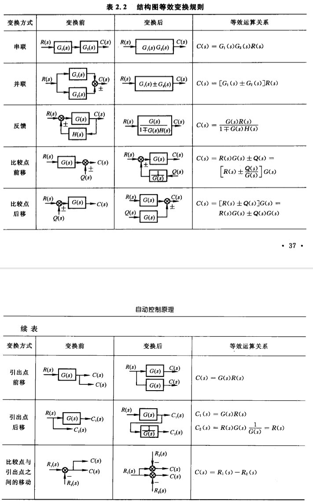

## 6.系统的开环传递函数
人为的断开系统的**主反馈通路**，将**前向通路与反馈通路上的传递函数乘在一起**，一般用$G(s)H(s)$表示，此处的开环传递函数是针对一个闭环的系统而言的，并不是指开环系统的传递函数

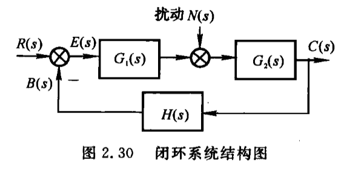

针对上述系统，其开环传递函数为
$$
G(s)H(s)=G_1(s)G_2(s)H(s)
$$

## 7.闭环系统的传递函数


- 研究**输入作用**时，令扰动为零$N(s)=0$，闭环传递函数为：
$$
\Phi(s)=\frac{C(s)}{R(s)}=\frac{G_1(s)G_2(s)}{1+G_1(s)G_2(s)H(s)}
$$

- 研究**干扰作用**下的闭环传递函数，令输入为零$R(s)=0$，此时闭环传递函数为：
$$
\Phi_N(s)=\frac{C(s)}{N(s)}=\frac{G_2(s)}{1+G_1(s)G_2(s)H(s)}
$$

- 根据叠加原理，系统的总输出=输入作用下输出+干扰作用下输出
$$
C(s)=\Phi(s)R(s)+\Phi_N(s)R(s)=\frac{G_1(s)G_2(s)+G_2(s)}{1+G_1(s)G_2(s)H(s)}R(s)
$$


## 8.闭环系统的误差传递函数
- 输入作用时，$N(s)=0$
$$
\Phi_e(s)=\frac{E(s)}{R(s)}=\frac{1}{1+G_1(s)G_2(s)H(s)}
$$

- 干扰作用时，$R(s)=0$
$$
\Phi_{eN}(s)=\frac{E(s)}{N(s)}=\frac{-G_2(s)H(s)}{1+G_1(s)G_2(s)H(s)}
$$

- 叠加后，总误差为
$$
E(s)=\Phi_e(s)R(s)+\Phi_{eN}(s)N(s)=\frac{R(s)-G_2(s)H(s)N(s)}{1+G_1(s)G_2(s)H(s)}
$$

# 三、时域分析与校正
## 1.时域法的作用与特点
- 直接**在时间域内**对系统进行分析和校正
- 不方便
- 最基本的方法
- 是以后学习复域法、频域法的基础

---

## 2.时域性能指标
- 动态性能指标
  - 
  - 延迟时间$t_d$：阶跃响应第一次到达终值的50%的时间
  - 上升时间$t_r$：阶跃响应从终值的10%上升到终值的90%所需的时间
  - 峰值时间$t_p$：阶跃响应超过终值达到第一个峰值的时间
  - **调节时间**$t_s$：阶跃响应保持在终值$\pm$ 5%误差带内的时间
  - 超调量$\sigma$ %：

  $$
  \sigma\%=\frac{h(t_p)-h(\infty)}{h(\infty)}\times100\%
  $$

- 稳态性能指标：时间趋于无穷时系统实际输出与理想输出之间的误差

---

## 3.一阶系统的时间响应及动态性能
标准闭环传递函数形式：
$$
\Phi(s)=\frac{1}{Ts+1}
$$

其中T为时间常数

其阶跃响应为：
$$
h(t)=1-e^{-\frac{t}{T}}
$$

调节时间：$t_s=3T$

---

## 4.二阶系统的时间响应及动态性能指标
标准闭环传递函数形式：
$$
\begin{aligned}
\Phi(s) & =\frac{1}{T^2s^2+2T\xi s+1}    \\
\Phi(s) & =\frac{\omega_n^2}{s^2+2\xi\omega_ns+\omega_n^2}      \\
\end{aligned}
$$
其中**$\xi$为阻尼比，$\omega_n$为无阻尼自然频率**

闭环特征方程为：
$$
D(s)=s^2+2\xi\omega_ns+\omega_n^2=0
$$

其根为：
$$
\lambda_{1,2}=-\xi\omega_n\pm \omega_n\sqrt{\xi^2-1}
$$

---

- 1.$\xi>1$时为过阻尼情况

根为$\lambda_{1,2}=-\xi\omega_n\pm \omega_n\sqrt{\xi^2-1}$,是**两个实根**，分布：

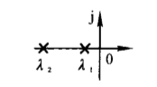

调节时间$t_s$查表得


---
- 2.$\xi=1$时为临界阻尼情况

根为$\lambda_{1,2}=-\omega_n$，为**两个相等的实根**
分布：

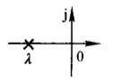

---

- 3.$\xi=0$时为零阻尼情况
根为$\lambda_{1,2}=\pm i\omega_n$，为**两个对称复根**
分布：

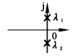

---

- 4.$0<\xi<1$时为**欠阻尼**情况
根为$\lambda_{1,2}=-\xi\omega_n\pm i\omega_n\sqrt{1-\xi^2}$
分布：

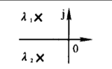

根的极坐标表示为：

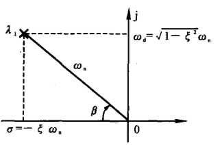

发现：
$$
\begin{aligned}
cos\beta  & = \frac{\xi \omega_n}{\omega_n}=\xi   \\
sin\beta  & = \frac{\omega_n\sqrt{1-\xi^2}}{\omega_n}=\sqrt{1-\xi^2}                         \\
|\lambda| & = \omega_n                            \\
\end{aligned}
$$

峰值时间：$t_p=\frac{\pi}{\omega_n\sqrt{1-\xi^2}}$

超调量：$\sigma \%=e^{-\xi\pi/\sqrt{1-\xi^2}}\times 100 \%$

调节时间：$t_s=\frac{3.5}{\xi\omega_n}$

---

## 5.欠阻尼系统极点分布对动态性能的影响
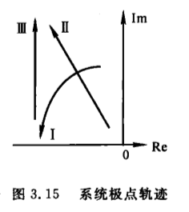

- 1.$\omega_n$不变，$\xi$增大（$\beta$角减小）时
  - 极点按图中曲线1运动
  - 超调量减小
  - 调节时间变短

- 2.$\xi$（$\beta$角）不变，$\omega_n$增大时
  - 极点按图中曲线2运动
  - 超调量不变
  - 调节时间变短

- 3.一般实际系统
  - 极点按图中曲线3运动
  - 超调量增大

---

## 6.测速反馈与PD控制---改善二阶系统动态性能的措施
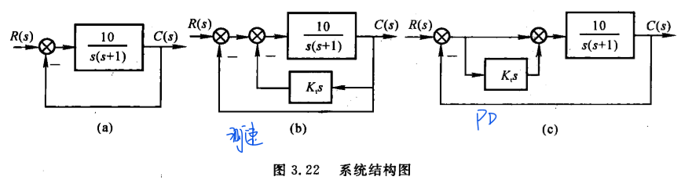

闭环传递函数：
- 原始：$\Phi(s)=\frac{10}{s^2+s+10}$
- 测速：$\Phi(s)=\frac{10}{s^2+(1+10K_t)s+10}$
- PD: $\Phi(s)=\frac{10(K_t+1)}{s^2+(1+10K_t)s+10}$


分析：
- 从物理本质上：
  - 测速反馈增大了原系统的阻尼比，**抑制了系统的振荡性**，减小了超调量
  - PD控制中微分具有超前性，将系统的调节作用提前，阻止了系统的过调
  
- 从实际实现上：
  - PD实现简单，成本低
  - 测速需要昂贵的设备

- 从对抗干扰方面：
  - PD环节为一个高通滤波器，会放大输入的噪声
  - 而测速反馈的信号来自于具有较大惯性的控制对象滤波后的输出端，噪声成分少，抗干扰能力强
  
- 从实现方式：
  - PD一般串联在**前向通道中信号功率较弱**的地方，需要用**放大器放大信号**到被控对象中
  - 测速反馈是**从大功率输出端引出信号到前端信号较弱**的地方。

- 从对稳态精度的影响：
  - **PD不会改变系统的开环增益**，不会影响稳态精度
  - **测速反馈会导致开环增益的下降**，造成稳态误差的增加

- 附加**闭环零点**的影响
  - 针对PD控制，相比于原始的系统，多了一个闭环零点，而闭环极点未受影响，所以不会影响单位阶跃响应中的各模态，但是会改变阶跃响应中各模态的加权系数
  - 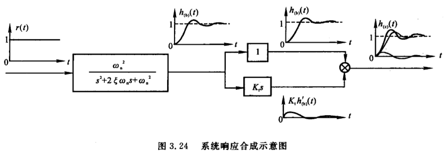
  - PD控制系统的输出可以看作是，阶跃信号通过原系统后响应再**叠加$K_t$**倍原系统输出的导数，如图所示
  - $h_{PD}(t)=h_{raw}(t)+K_t h_{raw}^{'}(t)$
  - 可以明显看出附加的零点会使系统的峰值时间提前，超调量增加，并且当闭环零点靠近虚轴越近，即$K_t$越大，这种影响越强烈

## 7.高阶系统的阶跃响应与动态性能
### 高阶系统传递函数一般形式：
$$
\begin{aligned}
\Phi(s)=\frac{M(s)}{D(s)} & = \frac{b_ms^m+b_{m-1}s^{m-1}+...+b_1s+b_0}{a_ns^n+a_{n-1}s^{n-1}+...+a_1s+a_0} \\
& =\frac{K\prod_{i=1}^m(s-z_i)}{\prod_{j=1}^q(s-\lambda_j) \prod_{k=1}^r(s^2+2\xi_k \omega_k s +\omega_k^2)}    \\
\end{aligned}
$$

其中$K=\frac{b_m}{a_n}$,$q+2r=n$（因为后面的$s^2+2\xi_k \omega_k s +\omega_k^2$会有两个实根或重根或复根）

---

### 其阶跃响应拉氏变换：
$$
\begin{aligned}
c(s)=\Phi(s)\frac{1}{s}& =\frac{K\prod_{i=1}^m(s-z_i)}{s\prod_{j=1}^q(s-\lambda_j) \prod_{k=1}^r(s^2+2\xi_k \omega_k s +\omega_k^2)}    \\

& =\frac{A_0}{s}+\sum_{j=1}^q\frac{A_j}{s-\lambda_j}+\sum_{k=1}^r\frac{B_ks+C_k}{s^2+2\xi_k\omega_ks+\omega_k^2}
\end{aligned}
$$

拉氏反变换后的时域输出为：
$$
c(t)=A_0+\sum_{j=1}^qA_je^{j\lambda_jt}+\sum_{k=1}^rD_ke^{-\sigma_kt}sin(\omega_{dk}t+\phi_k)
$$

---
### 闭环主导极点
前提：针对一个**稳定收敛**的系统
- 远离虚轴的极点对应的模态收敛速度较快，仅影响阶跃响应起始部分
- 距离虚轴较近的极点模态衰减缓慢，系统的动态性能**主要取决于这些极点对应的响应分量**
- **距离虚轴最近并且周围没有零点的极点对系统的动态性能起着主导作用，称为主导极点**

### 估算高阶系统动态性能指标的零点极点法
可忽略的极点情况：
- 某极点的实部大于**主导极点**5~6倍以上时
- 两相邻零、极点之间的距离比他们本身的模值小一个数量级时，该**零、极点对**为**偶极子**，其对响应的作用近似抵消

忽略部分极点后参照表，根据剩余的闭环零极点分布情况进行估算

---

## 8.线性系统的稳定性分析
稳定性：扰动的加入使得系统偏离了平衡状态，当扰动消失后，系统**恢复到平衡的能力**

### 8.1稳定的**充分必要条件**：
系统闭环传递函数的**所有特征根都具有负的实部**
或
系统的**闭环特征根均位于左半s平面**

### 8.2稳定性判据
- 判定稳定性的必要条件
系统的特征方程为：
$$
D(s)=a_ns^n+a_{n-1}^{n-1}+...+a_1s+a_0 ,(a_n>0)
$$

必要条件：
$$
a_i>0 (i=0,1,2,...,n-1)
$$

满足此必要条件的**一二阶系统**必然稳定，但是高阶系统不一定，高阶系统还需要用**劳斯判据**来判断
- 劳斯判据
劳斯表：

有规律

- 系统稳定的充分必要条件为：**劳斯表中第一列系数都大于0，否则系统不稳定**
- 第一列系数**符号改变的次数**就是系统特征方程中**正实根的个数**

## 9.线性系统的稳态误差
- 稳态误差是系统的稳态性能指标
- 稳定的系统研究稳态误差才有意义
- 无差系统：阶跃输入下，没有原理性稳态误差的系统
- 有差系统：阶跃输入下，有原理性误差的系统


### 9.1误差与稳态误差
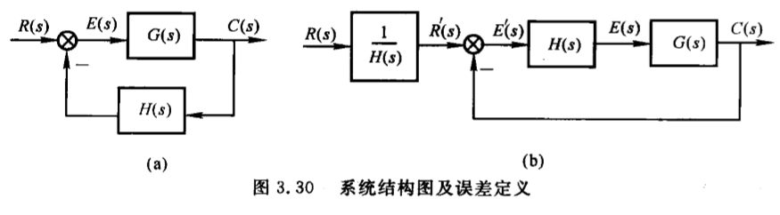

误差：
- 按输入端定义误差：(将偏差定义为误差)
$$E(s)=R(s)-C(s)H(s)$$
- 按输出端定义误差：
$$E^{'}(s)=\frac{R(s)}{H(s)}-C(s)$$

- 两者之间存在关系：
$$E^{'}(s)=\frac{E(s)}{H(s)}$$

稳态误差（两种含义）：
- 时间趋于无穷大时误差的值：$e_{ss}=\lim_{t \to \infty}e(t)$，为**静态误差**或终值误差
- 误差$e(t)$中的稳态分量$e_s(t)$,称为动态误差


### 9.2计算稳态误差
A.计算静态误差，利用终值定理

步骤：
- 1.判断系统的稳定性。不稳定系统终值定理不适用
- 2.求误差传递函数
$$\phi_e(s)=\frac{E(s)}{R(s)},\phi_{en}(s)=\frac{E(s)}{N(s)}$$
- 3.利用终值定理计算
$$e_{ss}=\lim_{t \to \infty}e(t)=\lim_{s \to 0}sE(s)=\lim_{s \to 0}[\phi_e(s)R(s)+\phi_{en}(s)N(s)]$$

B.静态误差系数法
如上图的系统，其开环传递函数可表示为：
$$
G(s)H(s)=\frac{K(\tau_1s+1)...(\tau_ms+1)}{s^v(T_1s+1)...(T_{n-v}s+1)}=\frac{K}{s^v}G_0(s)
$$

其中
$$
G_0(s)=\frac{(\tau_1s+1)...(\tau_ms+1)}{(T_1s+1)...(T_{n-v}s+1)}
$$

K为开环增益
v为系统开环传递函数中**纯积分环节**的个数，称为**系统型别**或**无差度**

- v=0时，对应的闭环系统为0型系统，称为有差系统
- v=1时，1型系统或一阶无差系统
- v=2时，2型系统或二阶无差系统

仅输入r(t)作用下的误差传递函数又可表示为
$$
\phi_e(s)=\frac{E(s)}{R(s)}=\frac{1}{1+G(s)H(s)}=\frac{1}{1+\frac{K}{s^v G_0(s)}}
$$

讨论各种输入下的静态位置误差系数：
- 1.阶跃输入时$r(t)=A1(t)$
$$
\begin{aligned}
e_{ss} & = \lim_{s \to 0}s\phi_e(s)R(s)   \\
       & = \lim_{s \to 0}s\frac{A}{s}\frac{1}{1+G(s)H(s)}   \\
       & = \lim_{s \to 0}\frac{A}{1+G(s)H(s)}   \\
       & = \frac{A}{1+\lim_{s \to 0}G(s)H(s)}
\end{aligned}
$$

定义静态位置误差系数为：
$$
K_p=\lim_{s \to 0}G(s)H(s)=\lim_{s \to 0}\frac{K}{s^v}
$$

稳态误差可表示为：
$$
e_{ss}=\frac{A}{1+K_p}
$$


- 2.速度输入时$r(t)=At$
$$
\begin{aligned}
e_{ss} & = \lim_{s \to 0}s\phi_e(s)R(s) \\
       & = \lim_{s \to 0}s\frac{A}{s^2}\frac{1}{1+G(s)H(s)}   \\
       & = \lim_{s \to 0}\frac{A}{s+sG(s)H(s)}   \\
\end{aligned}
$$

定义静态速度误差系数为：
$$
K_v=\lim_{s \to 0}sG(s)H(s)=\lim_{s \to 0}\frac{K}{s^{v-1}}
$$


稳态误差可表示为：
$$
e_{ss}=\frac{A}{K_v}
$$

- 3.加速度输入时，$r(t)=\frac{A}{2}t^2$
$$
\begin{aligned}
e_{ss} & = \lim_{s \to 0}s\phi_e(s)R(s)   \\
       & = \lim_{s \to 0}s\frac{A}{s^3}\frac{1}{1+G(s)H(s)}   \\
       & = \lim_{s \to 0}\frac{A}{s^2}\frac{1}{1+G(s)H(s)}   \\
       & = \frac{A}{\lim_{s \to 0}s^2G(s)H(s)}  \\
\end{aligned}
$$


定义静态加速度误差系数为：
$$
K_a=\lim_{s \to 0}s^2G(s)H(s)=\lim_{s \to 0}\frac{K}{s^{v-2}}
$$

稳态误差可表示为：
$$
e_{ss}=\frac{A}{K_a}
$$

总结:控制输入作用下系统稳态误差随系统结构、参数、输入形式变化的规律

---
|输入类型||||$r(t)=A1(t)$|$r(t)=At$|$r(t)=\frac{A}{2}t^2$|
|:-:|:-:|:-:|:-:|:-:|:-:|:-:|
|系统型别|$k_p=\lim_{s \to 0}\frac{K}{s^v}$|$k_v=\lim_{s \to 0}\frac{K}{s^{v-1}}$|$k_a=\lim_{s \to 0}\frac{K}{s^{v-2}}$|$e_{ss}=\frac{A}{1+K_p}$|$e_{ss}=\frac{A}{K_v}$|$e_{ss}=\frac{A}{K_a}$|
|0|$K$|0|0|$\frac{A}{1+K}$|$\infty$|$\infty$|
|1|$\infty$|$K$|0|0|$\frac{A}{K}$|$\infty$|
|2|$\infty$|$\infty$|$K$|0|0|$\frac{A}{K}$|
---

- 系统稳定时，增大开环增益K，可以减小稳态误差
- 纵向看，增加开环传递函数中积分环节数，可消除稳态误差
- 系统型别是系统响应达到稳态时，输出跟踪输入信号的一种能力储备
- 系统回路中的积分环节越多，系统稳态输出跟踪输入信号的能力越强
- 但积分环节越多，系统越容易不稳定，实际系统2型以上很少

C.干扰引起的稳态误差
$$
\begin{aligned}
e_{ssn} & = \lim_{s \to 0} s\phi_{en}(s)N(s)       \\
        & = \lim_{s \to 0} \frac{-G_2(s)H(s)}{1+G_1(s)G_2(s)H(s)}N(s)       \\
\end{aligned}
$$

当$|G_1(s)G_2(s)H(s)|\ge 1$时
$$
e_{ssn}\approx \lim_{s \to 0}s \frac{-1}{G_1(s)}N(s)
$$


**D.动态误差系数**
- 思路：将系统的误差传递函数$\phi_{e}(s)=\frac{E(s)}{R(s)}$在s=0处展开成泰勒级数：
$$
\begin{aligned}
\phi_e(s) & = \phi_e(0)+\frac{1}{1!}\phi_e^{'}(0)s+\frac{1}{2!}\phi_e^{''}(0)s^2+...+\frac{1}{l!}\phi_e^{(l)}(0)s^l+...     \\
\end{aligned}
$$

$$
c_i=\frac{1}{i!}\phi_e^{(i)}(0)s^i
$$

$$
\begin{aligned}
\phi_e(s) & = c_0+c_1s+c_2s^2+...   \\
     E(s) & = \phi_e(s)R(s)=c_0R(s)+c_1R(s)s+c_2R(s)s^2+...  \\
e_s(t) & = c_0r(t)+c_1r^{'}(t)+c_2r^{''}(t)+...  \\
       & = \Sigma_{i=0}^\infty c_ir^{(i)}(t)     \\

\end{aligned}
$$


注：上式是$\phi_e(s)$在s=0处展开的，对应于时域中$t \to \infty$时的特性，所以只含有$e(t)$中的稳态分量$e_s(t)$

对于适用静态误差系数法求稳态误差的系统，静态误差系数和动态误差系数之间存在一定的关系
$$
\begin{aligned}
0型系统：c_0 & = \frac{1}{1+K_p}    \\
1型系统：c_1 & = \frac{1}{K_v}      \\
2型系统：c_2 & = \frac{1}{K_a}      \\
\end{aligned}
$$


## 10.系统的时域校正
- 在系统中加入一些参数和结构可调整的装置，如微分积分电路或速度传感器，来改变系统的结构，提高系统的性能
- 在不改变系统基本部分的前提下，选择合适的校正装置，并计算确定其参数，使系统满足各项性能指标
- 常见的校正方式：串联校正、反馈校正、顺馈校正

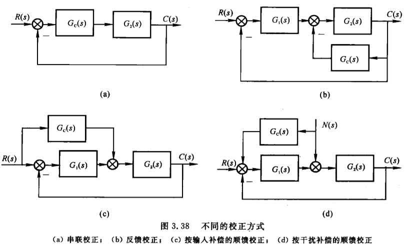
$G_c(s)$为待求得校正装置传递函数

### 10.1反馈校正
定义：在主反馈环内，为改善系统的性能而加入反馈装置的校正方式

作用：
**1.比例负反馈可以减小被包围环节的时间常数，削弱被包围环节的惯性，提高响应的快速性**

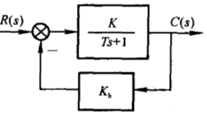

$G(s)=\frac{K}{Ts+1}$被比例负反馈包围后，新系统传递函数为：
$$
\begin{aligned}
G^{'}(s) & = \frac{K}{Ts+1+KK_h}=\frac{K^{'}}{T^{'}s+1}  \\
T^{'}    & = \frac{T}{1+KK_h}      \\
K^{'}    & = \frac{K}{1+KK_h}      \\
\end{aligned}
$$

比较后发现：$T^{'}<T,K^{'}<K$，得出系统被比例负反馈包围后，时间常数减小带来更快收敛速度，增益同时也降低，可能需要补偿。


**2.负反馈可以降低参数变化或系统中不希望有的特性对于系统的影响（如非线性特性）**
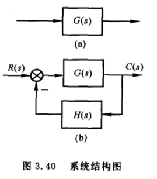

对于此原系统（未加反馈），若因某些原因，系统传递函数产生一个增量$\Delta G(s)$，系统输出变为：
$$
C(s)+\Delta C(s)=[G(s)+\Delta G(s)]R(s)
$$

此时增量输出为：
$$
\Delta C(s)=\Delta G(s)R(s)
$$

给此系统包围负反馈，形成闭环系统后，系统输出为：
$$
C(s)+\Delta C(s)=\frac{G(s)+\Delta G(s)}{1+[G(s)+\Delta G(s)]H(s)} R(s)
$$


此时增量输出为：
$$
\Delta C(s)=\frac{\Delta G(s)}{1+[G(s)+\Delta G(s)]H(s)} R(s) \approx \frac{\Delta G(s)}{1+G(s)H(s)} R(s)
$$


对比未加反馈时系统，增加反馈后，有效减小了增量$\Delta G(s)$导致的系统增量输出$\Delta C(s)$

若系统中某环节性能很差，影响了整个系统的性能，可以采用局部负反馈包围此环节，来抑制其不良影响


 **3.合理利用正反馈可以提高放大倍数**
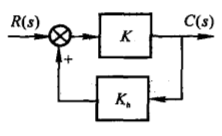

此系统中前向通道中放大倍数为K，使用**正反馈**后放大倍数为：
$$
\frac{K}{1-KK_h}
$$
若取$K_h \approx \frac{1}{K}$，可以大幅度的增大闭环的放大倍数。但是可能会出现负面效果

 ### 10.2复合校正

定义：在闭环内部使用串联校正或反馈校正，同时在闭环外部使用顺馈校正

**1.按干扰补偿的顺馈控制**

- 将干扰信号通过前馈通道引入闭环回路中，形成按干扰补偿的复合控制
- 合理设计，可以有效减小干扰作用下的稳态误差

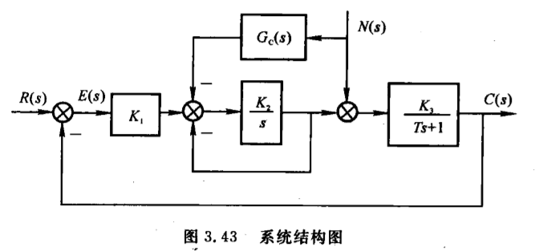

针对此系统，设及合适的前馈通道传递函数，使得系统在干扰$n(t)=1(t)$作用下的稳态误差为0

先求由干扰导致的误差传递函数$\phi_{en}(s)$
$$
\begin{aligned}
\{[R(s)-C(s)k_1 - N(s)G_c(s)]\frac{k_2}{s+k_2}+N(s)\}\frac{k_3}{Ts+1}=C(s)	\\
\end{aligned}
$$
因为仅考虑干扰作用，故$R(s)=0$，误差$E(s)=-C(s)$

整理得
$$
\phi_{en}(s)=\frac{E(s)}{N(s)}=\frac{k_2k_3G_c(s)-k_2k_3-k_3s}{Ts^2+(k_2T+1)s+k_2+k_1k_2k_3}
$$
求稳态误差：
$$
\begin{aligned}
e_{ssn} & =\lim_{t \to \infty}e(t)= \lim_{s \to 0}sE(s)=\lim_{s \to 0}s\phi_{en}(s)N(s)	\\
& = \frac{k_2k_3G_c(s)-k_2k_3}{k_2+k_1k_2k_3}
\end{aligned}
$$
清晰可见当$G_c(s)=1$时，可以消除干扰导致的稳态误差

**2.按输入补偿的顺馈控制**

- 可用于减小输入作用下的稳态误差

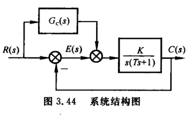

合理设计前馈通道传递函数$G_c(s)$使得该系统在速度输入$r(t)=At$输入下的稳态误差为零

先求误差传递含函数
$$
\{[R(s)-C(s)]+R(s)G_c(s)\}\frac{K}{s(Ts+1)}=C(s)
$$
误差$E(s)=R(s)-C(s)$整理得：
$$
\phi_{es}=\frac{E(s)}{R(s)}=\frac{kG_c(s)+s(Ts+1)}{s(Ts+1)+K}
$$
稳态误差
$$
\begin{aligned}
e_{ss} & = \lim_{ s \to 0}s\phi_{es}(s)R(s)	\\
	   & = \lim_{ s \to 0}A\frac{s(Ts+1)-KG_c(s)}{s^2(Ts+1)+Ks}
\end{aligned}
$$
令$e_{ss}=0$得
$$
G_c(s)=\frac{s}{K}
$$

# 四、根轨迹法
## 1.根轨迹基本概念

- 定义：开环系统中某一参数（例如：根轨迹增益$K^*$）从零变化到无穷大时，系统**闭环传递函数的闭环特征方程的根**在s平面上的移动轨迹

例：某单位反馈系统，其前向通路传递函数为$\frac{K}{s(0.5s+1)}$，此系统的开环传递函数为：

$$
G(s)=\frac{K}{s(0.5s+1)}=\frac{K^*}{s(s+2)}
$$

其中：$K^*=2K$

此系统的闭环传递函数为：
$$
\Phi(s)=\frac{K^*}{s^2+2s+K^*}
$$
令闭环特征方程等于零：
$$
s^2+2s+K^*=0
$$
解得特征根：
$$
\lambda_1=-1+\sqrt{1-K^*}	\\
\lambda_2=-1-\sqrt{1-K^*}
$$
让$K^*$从0变化到$+\infty$，得到的特征根$\lambda_1$、$\lambda_2$的变化就是根轨迹

## 2.闭环零极点与开环零极点之间的关系(定性)
带观测的系统：

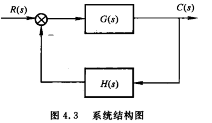

其中$G(s)H(s)$使用首一标准型可表示为
$$
G(s)=K_G^*\frac{\prod_{i=1}^f(s-z_i)}{\prod_{i=1}^g(s-p_i)}
$$

$$
H(s)= K_H^*\frac{\prod_{j=f+1}^m(s-z_j)}{\prod_{j=g+1}^n(s-p_j)}
$$

其开环传递函数可表示为：
$$
G(s)H(s)=K_G^* K_H^*\frac{\prod_{i=1}^f(s-z_i) \prod_{j=f+1}^m(s-z_j)}{\prod_{i=1}^g(s-p_i) \prod_{j=g+1}^n(s-p_j)}
$$

令$K^*=K_G^* K_H^*$，此为开环增益，亦为系统根轨迹增益

简化得：
$$
G(s)H(s)=K^*\frac{\prod_{i=1}^m(s-z_i)}{\prod_{i=1}^n(s-p_i)}
$$

系统的闭环传递函数为：
$$
\begin{aligned}
\Phi(s) & = \frac{G(s)}{1+G(s)H(s)}     \\
        & = K_G^* \frac{\prod_{i=1}^f(s-z_i) \prod_{j=g+1}^n(s-p_j)}{\prod_{i=1}^n(s-p_i)+K^* \prod_{i=1}^m(s-z_i)}         \\
\end{aligned}
$$

对比发现:
- 闭环零点由**前向通路传递函数$G(s)$的零点**与**反馈通道传递函数$H(s)$的极点**组成
- 闭环极点与开环传递函数的零点、极点及增益都有关

总结：根轨迹法的**任务**：先求出开环传递函数的零极点以及根轨迹增益，然后用图解法找到闭环极点，再补上闭环零点，分析系统的性能

## 3.根轨迹方程
根据上节，某系统的开环传递函数为：
$$
G(s)H(s)=K^*\frac{\prod_{i=1}^m(s-z_i)}{\prod_{i=1}^n(s-p_i)}
$$

系统的闭环传递函数为：
$$
\begin{aligned}
\Phi(s) & = \frac{G(s)}{1+G(s)H(s)}     \\
\end{aligned}
$$

闭环特征方程为：
$$
1+G(s)H(s)=0
$$

即：
$$
G(s)H(s)=K^*\frac{\prod_{i=1}^m(s-z_i)}{\prod_{i=1}^n(s-p_i)}=-1
$$


由此式可以得出两个条件：

幅值条件：
$$
|G(s)H(s)|=K^*\frac{\prod_{i=1}^m|(s-z_i)|}{\prod_{i=1}^n|(s-p_i)|}=1
$$

相角条件：
$$
\begin{aligned}
\angle G(s)H(s) & = \Sigma_{i=1}^m \angle(s-z_i) - \Sigma_{j=1}^n \angle(s-p_j)     \\
                & = \Sigma_{i=1}^m \phi_i - \Sigma_{j=1}^n \theta_j     \\
                & = (2k+1)\pi       \\
                & k=0,\pm1,\pm2,...     \\
\end{aligned}
$$
其中$\Sigma \phi_i$、$\Sigma \theta_j$为开环零点、极点到根轨迹上某点的相角之和

分析：
- s平面上某点，只要能够满足相角条件
  - 此点一定在根轨迹上
  - 此点也能满足幅值条件
  - 此点对应的根轨迹增益可以通过幅值条件回代求出
- 相角条件是确定根轨迹S平面上一点是否在根轨迹上的充分必要条件


## 4.绘制根轨迹的基本法则
- 1.根轨迹起始于开环极点，终止于开环零点。若开环零点数m少于开环极点数n，则有n-m条根轨迹指向无穷远处
- 2.根轨迹的分支数量等于开环零点数m、开环极点数n中较大的。根轨迹连续并且关于实轴对称
- 3.实轴上某一区域，若右边开环零、极点数目之和为奇数，此区域必定为根轨迹区域
- 4.当开环极点个数n大于开环零点个数m时，有n-m条根轨迹沿着渐近线趋向于无穷远处。渐近线与实轴焦点为$\sigma_a$，与实轴夹角为$\phi_a$
$$
\phi_a=\frac{(2k+1)\pi}{n-m}
$$

$$
\sigma_a=\frac{\Sigma_{j=1}^n p_j - \Sigma_{i=1}^m z_i}{n-m}
$$

$$
k=0,\pm1,\pm2,...
$$

- 5.多条根轨迹的分离点d坐标方程为
$$
\Sigma_{j=1}^n \frac{1}{d-p_j}=\Sigma_{i=1}^m \frac{1}{d-z_i}
$$
- 6.根轨迹与虚轴的交点的求解，令闭环特征方程中$s=j\omega$，然后分别令该方程的实部和虚部为零，联立求得

- 7.根轨迹的起始角$\Theta_{p_i}$：根轨迹离开开环复数极点处的切线与正实轴的夹角。终止角$\phi_{z_i}$：根轨迹进入开环复数零点处的切线与正实轴的夹角。两者可用相角条件求出

- 8.当系统开环传递函数$G(s)H(s)$的分子、分母阶次差$(n-m)$大于等于2时，系统闭环极点之和等于系统开环极点之和

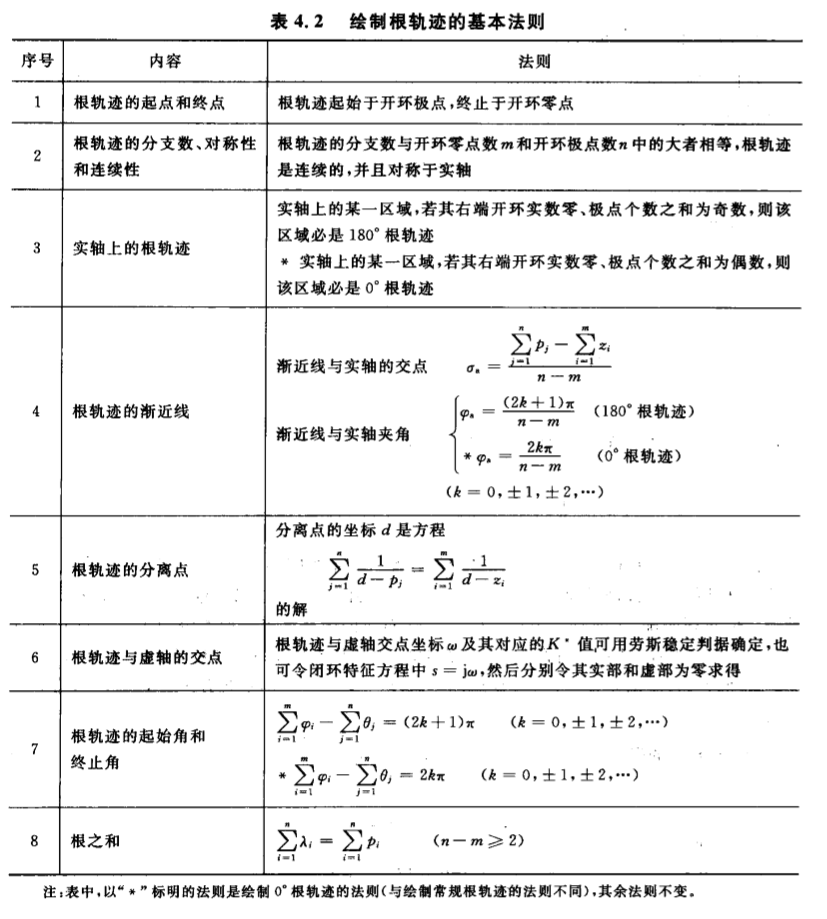

## 5.matlab求解根轨迹
```matlab
z=[-5];
p=[0,-1,-3,-12];
k=[1]

G=zpk(z,p,k);
rlocus(G)
[k,poles]=rlocfind(G)
```
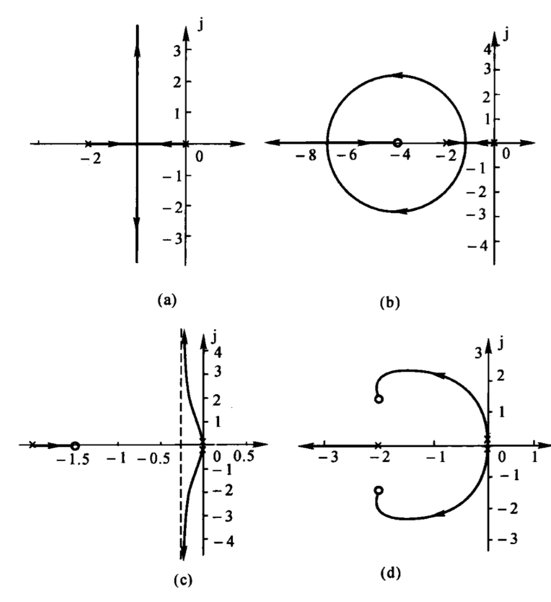

## 6.广义根轨迹
意义：以上所研究的根轨迹相关，都是研究在负反馈条件下，根轨迹增益$K^*$变化时的根轨迹。然而，有时需要**分析除$K^*$外其他参量变化**对系统性能的影响，此为**广义根轨迹**

### 6.1.参数根轨迹
- 除根轨迹增益$K^*$以外其他参量从零变化到无穷大时的根轨迹为参数根轨迹
- 参数根轨迹的绘制法则与常规根轨迹绘制完全相似。
- 但需要引入“**等效开环传递函数**”，将绘制参数根轨迹的问题**转化为绘制$K^*$变化时的常规根轨迹的形式**

例：
某单位反馈系统的开环传递函数为：
$$
G(s)=\frac{\frac{1}{4}(s+a)}{s^2(s+1)}
$$
要求绘制当$a从0 \to \infty$时的根轨迹

系统的闭环传递函数为：
$$
\phi(s)=\frac{\frac{1}{4}(s+a)}{s^3+s^2+\frac{1}{4}(s+a)}
$$

闭环特征方程为：
$$
D(s)=s^3+s^2+\frac{1}{4}(s+a)=0
$$

来**构造等效开环传递函数**，将含有可变参数的项放在分子上，**保证所构造的等效开环传递函数所对应的闭环传递函数的闭环特征方程与原来一样**
$$
G^*(s)=\frac{\frac{1}{4}a}{s(s^2+s+\frac{1}{4})}
$$

但是**等效开环传递函数对应的闭环传递函数的闭环零点与原系统的闭环零点并不一致**


### 6.2零度根轨迹
- 在负反馈条件下，根轨迹方程为：$G(s)H(s)=-1$，相角条件为：$\angle G(s)H(s)=(2k+1)\pi$，此种情况下为常规根轨迹，也称为$180^o$根轨迹
- 在**正反馈**条件下，根轨迹方程为：$G(s)H(s)=1$，相角条件为：$\angle G(s)H(s)=2k\pi$，此种情况下为零度根轨迹，也称为$0^o$根轨迹

零度根轨迹的绘制**与常规根轨迹的绘制**有所不同

$0^o$根轨迹方程为：
$$
K^* \frac{\prod_{i=1}^m (s-z_i)}{\prod_{j=1}^n (s-p_j)}=1
$$

幅值条件：
$$
|G(s)H(s)|=K^* \frac{\prod_{i=1}^m |(s-z_i)|}{\prod_{j=1}^n |(s-p_j)|}=1
$$

相角条件：
$$
\angle G(s)H(s)=\Sigma_{i=1}^m \angle(s-z_i) - \Sigma_{j=1}^n \angle (s-p_j)=\Sigma_{i=1}^m \phi_i - \Sigma_{j=1}^n\theta_j=2k\pi
$$

对比常规根轨迹，发现：两者幅值条件是相同的，**相角条件则不一样**。所以，对于绘制根轨迹的法则，**涉及到相角条件的需要做出修改**，具体地，法则3、4、7要修改。

修改后法则：
- 3.实轴上某一区域，若右边开环零、极点数目之和为**偶数**，此区域必定为根轨迹区域
- 4.当开环极点个数n大于开环零点个数m时，有n-m条根轨迹沿着渐近线趋向于无穷远处。渐近线与实轴焦点为$\sigma_a$，与实轴夹$\phi_a$
$$
\phi_a=\frac{2k\pi}{n-m}
$$

$$
\sigma_a=\frac{\Sigma_{j=1}^n p_j - \Sigma_{i=1}^m z_i}{n-m}
$$

$$
k=0,\pm1,\pm2,...
$$

- 7.根轨迹的起始角$\theta_{p_i}$：根轨迹离开开环复数极点处的切线与正实轴的夹角。终止角$\phi_{z_i}$：根轨迹进入开环复数零点处的切线与正实轴的夹角。两者可用相角条件求出


## 7.利用根轨迹分析系统的性能
### 7.1.利用闭环主导极点估算系统的性能指标(纯应用计算)
### 7.2.

# 五、频域分析与校正
## 1.线性系统的频域分析与校正

频域分析的研究意义：
- 前面分别学习的时域内的分析法和根轨迹分析法，根轨迹法实际是复域分析法
- 频域法是基于频率特性或者频率响应对系统进行分析和设计的一种**图解方法**，也称为频率响应法
- 其优点有：
  - 系统的**传递函数难以确定**时，可以通过**实验法**确定频率特性
  - 一定条件下，能够推广到非线性系统中


## 前提补充
欧拉公式：
$$
\begin{aligned}
e^{it}  & = cost+isint    \\
e^{-it} & = cost-isint    \\
cost    & = \frac{e^{it}+e^{-it}}{2}     \\
sint    & = \frac{e^{it}-e^{-it}}{2i}
\end{aligned}
$$

拉普拉斯变换
$$
F(s)=\int_0^{+\infty} f(t) e^{-st} dt
$$

正弦信号的拉普拉斯变换（两次分部积分求得）
$$
\begin{aligned}
r(t) & = Asin\omega t       \\
R(s) & = \int_0^{+\infty} Asin\omega t e^{-st} dt    \\
     & = -\frac{A}{s} \int_0^{+\infty} sin\omega t de^{-st}    \\
     & = -\frac{A}{s}[sin\omega t e^{-st}|_0^{+\infty}-\omega\int_0^{+\infty} e^{-st} cos\omega t dt]   \\
     & = \frac{A \omega}{s} \int_0^{+\infty} e^{-st} cos\omega t dt     \\
     & = -\frac{A \omega}{s^2} \int_0^{+\infty} cos\omega t de^{-st}    \\
     & = -\frac{A \omega}{s^2} [cos\omega t e^{-st}|_0^{+\infty}+\omega \int_0^{+\infty}e^{-st} sin\omega t]    \\
     & = -\frac{A \omega}{s^2} [0-1+w\int_0^{+\infty}e^{-st} sin\omega t]       \\

     得方程式：
R(s) & = \frac{A \omega}{s^2}[1-\frac{1}{A}\omega R(s)]   \\
R(s) & = \frac{A\omega}{s^2+\omega^2}       \\
\end{aligned}
$$


## 2.频率特性的基本概念
### 2.1 频率响应
线性系统在**输入为正弦信号**时，系统的**稳态输出**随频率从$0 \to +\infty$变化的规律，称为系统的频率响应

推导说明：
系统的传递函数可表示为：
$$
G(s)=\frac{C(s)}{R(s)}=\frac{M(s)}{(s+p_1)(s+p_2)...(s+p_n)}
$$

当输入信号$r(t)=Xsin\omega t$时
$$
R(s)=\frac{X\omega}{s^2+\omega^2}
$$

则输出信号为：
$$
\begin{aligned}
C(s) & = R(s)G(s)   \\
     & = \frac{M(s)}{(s+p_1)(s+p_2)...(s+p_n)} \frac{X\omega}{s^2+\omega^2}   \\
     & = \frac{C_1}{s+p_1}+\frac{C_2}{s+p_2}+...+\frac{C_n}{s+p_n}+\frac{C_a}{s+j\omega}+\frac{C_{-a}}{s-j\omega}   \\
\end{aligned}
$$

拉氏反变换后
$$
c(t)=C_1e^{-p_1t}+C_2e^{-p_2t}+...+C_ne^{-p_nt}+C_a e^{j\omega t}+C_{-a} e^{-j\omega t}
$$


如果系统稳定，上式除了最后两项，都会衰减为0，所以输出的稳态分量为
$$
c_s(t)=C_a e^{j\omega t}+C_{-a} e^{-j\omega t}
$$

系数$C_a$、$C_{-a}$可由留数法求得

$$
\begin{aligned}
C_a & = G(s)\frac{X\omega}{(s+j\omega)(s-j\omega)}(s-j\omega) |_{s=j\omega}=\frac{XG(j\omega)}{2j}    \\
C_{-a} & = G(s)\frac{X\omega}{(s+j\omega)(s-j\omega)}(s-j\omega) |_{s=-j\omega}=-\frac{XG(-j\omega)}{2j}    \\
\end{aligned}
$$

因为
$$
G(j\omega)=|G(j\omega)|e^{j\angle G(j\omega)}
$$

所以系统输出的稳态分量可写为
$$
\begin{aligned}
c_s(t) & = \frac{XG(j\omega)}{2j} e^{j\omega t}-\frac{XG(-j\omega)}{2j} e^{-j\omega t}   \\
       & = X\frac{|G(j\omega)|e^{j\angle G(j\omega)}e^{jwt}-|G(j\omega|e^{-j\angle G(j\omega)}e^{-jwt}}{2j}    \\
       & = X\frac{|G(j\omega)|}{2j}[e^{j\angle G(j\omega)}e^{jwt}-e^{-j\angle G(j\omega)}e^{-jwt}]   \\
       & = X\frac{|G(j\omega)|}{2j}[e^{j(\angle G(j\omega)+wt)}-e^{-j(\angle G(j\omega)+wt)}]   \\
       & = X|G(j\omega)|sin[\omega t+\angle G(j\omega)]    \\
\end{aligned}
$$

综上
输入为：$r(t)=Xsin\omega t$时，

输出的稳态分量为：$c_s(t)=X|G(j\omega)|sin[\omega t+\angle G(j\omega)]$

比较发现：
- 线性系统在输入正弦信号时，系统稳态输出为与输入**同频率**的正弦信号
- 输出正弦信号与输入正弦信号幅值之比为$|G(j\omega)|$
- 输出正弦信号与输入正弦信号相角之差为$\angle G(j\omega)$


### 2.2频率特性
系统的频率特性即为$G(j\omega)$,定义为**系统稳态正弦响应与输入正弦信号的复数比**
$$
\begin{aligned}
G(j\omega) & = \frac{X|G(j\omega)| e^{j\angle G(j\omega)}}{Xe^{j0}}   \\
           & = |G(j\omega)|e^{j\angle G(j\omega)}   \\
           & = A(\omega)e^{j\phi(\omega)}     \\
\end{aligned}
$$

其中$A(\omega)=|G(j\omega)|$称为系统的**幅频特性**,$\phi(\omega)=\angle G(j \omega)$为系统的**相频特性**

分析：
若已经得知系统的传递函数，则**令$s=j\omega$就得到系统的频率特性$G(j\omega)$**

如对于一阶系统$G(s)=\frac{1}{Ts+1}$，令$s=j\omega$，得一阶系统的频率特性$G(j\omega)=\frac{1}{Tj\omega+1}$

### 2.3频率特性的图形表达方式
在使用频率法分析、设计系统时，并不是直接用频率特性的函数表达式，而是将其绘制成一些曲线，借助这些曲线对系统进行图解

|序号|名称|图形常用名|坐标系|
|:-:|:-:|:-:|:-:|:-:|:-:|
|1|幅频、相频特性曲线|频率特性图|直角坐标系|
|2|幅相频率特性曲线|极坐标图、**奈奎斯特图**|极坐标|
|3|对数幅频、相频特性曲线|对数频率特性、**伯德图**|半对数坐标|
|4|对数幅相特性曲线|对数幅相图、尼柯尔斯图|对数幅相图|

其中第2、3种使用较为广泛


- 1.频率特性曲线：频率特性$|G(j\omega)|$幅值和相角随$\omega=0 \to +\infty$变化，在直角坐标系所绘得
- 2.幅相频率特性曲线：因为频率特性$|G(j\omega)|$可以使用极坐标的形式表示，此曲线就是在$\omega=0 \to +\infty$时，向量$G(j\omega)$的端点在复平面G上绘出来的轨迹
  - 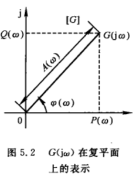


- 3.**对数频率特性曲线**(重要)：
  - 又称 Bode 伯德图
  - 频率特性曲线中最常用的
  - Bode图中幅频特性为$G(j\omega)$的对数值$20lg|G(j\omega)|$与$\omega$之间的关系；相频则为则是$G(j\omega)$的相角$\phi(\omega)$与频率$\omega$之间的关系
  - 在作图时，为了方便，将幅频、相频特性曲线绘制在一起，使用同一个横坐标作为频率$\omega$轴，横坐标虽然标注的是$\omega$的实际值，但是却采用对数刻度，单位为$rad/s$，这意味着实际距离是按$\omega$的对数$lg\omega$来取的。例：坐标轴上两点$\omega_1$和$\omega_2$（$\omega_1<\omega_2$），这两点之间的距离为$lg\omega_2-lg\omega_1=lg\frac{\omega_2}{\omega_1}$，而不是$\omega_2-\omega_1$
  - 频率$\omega$每变化10倍称为一个十倍频程，或称“旬距”，记作dec
    - 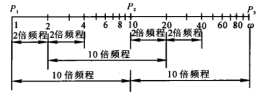
  - 对数幅频特性曲线的纵坐标为$L(\omega)=20lgA(\omega)$，称为对数幅值，单位为dB
  - 对数幅频特性曲线的纵坐标经过对数转换，所以纵坐标按分贝值是线性刻度的，$A(\omega)$幅值放大10倍，$L(\omega)$就增加20dB
  - 对数相频特性曲线纵坐标为相角，单位为度，线性刻度

- 对数频率特性曲线的优点：
  - 横坐标采用对数刻度，相对展宽了低频段，压缩了高频段，而低频段频率特性的形状对于控制系统的性能有较重要的意义
  - 对数运算可以将乘除转化为加减运算，当绘制多个环节串联而成的系统时，可以分别求出各环节的对数幅频特性，然后加减运算即可
  - 在曲线上可用直线近似代替，具有相当的精度
  - 将实验所得的频率特性数据用分段直线近似代替，很容易得出实验对象的频率特性表达式或者是传递函数

- 4.对数幅相特性曲线
  - Nichols曲线
  - 由对数幅频特性与对数相频特性合并而成
  - 横轴为相角$\phi(\omega)$,单位为度
  - 纵轴为对数幅频值$L(\omega)=20lgA(\omega)$

## 3.幅相频率特性（Nyquist图）

### 3.1比例环节的幅相特性曲线

比例环节的传递函数为$G(s)=K$

其频率特性为
$$
\begin{aligned}
G(j \omega) & = K+j0=Ke^{j0}		\\
A(\omega)	& = |G(j \omega)|=k		\\
\phi(\omega)& = \angle G(j \omega)=0^o		\\
\end{aligned}
$$

- 比例环节的幅相特性是G平面实轴上一点
- 比例环节稳态正弦响应的振幅是输入正弦信号幅值的K倍
- 并且响应与输入同相位
- 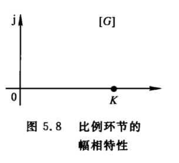

### 3.2微分环节

微分环节的传递函数为$G(s)=s$

其频率特性为
$$
\begin{aligned}
G(j \omega) & = j\omega=\omega e^{j 90^o}		\\
A(\omega)	& = |G(j \omega)|=\omega		\\
\phi(\omega)& = \angle G(j \omega)=90^o		\\
\end{aligned}
$$

- 此图1号曲线所示
- 当$\omega=0 \to +\infty$时，$G(j\omega)$从零点到虚轴正无穷远处
- 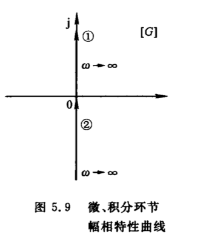

### 3.3积分环节

积分环节的传递函数为$G(s)=\frac{1}{s}$

其频率特性为
$$
\begin{aligned}
G(j \omega) & = \frac{1}{j\omega}=-\frac{j}{\omega}=\frac{1}{\omega} e^{j -90^o}		\\
A(\omega)	& = |G(j \omega)|=\frac{1}{\omega}		\\
\phi(\omega)& = \angle G(j \omega)=-90^o		\\
\end{aligned}
$$

- 此图2号曲线所示
- 当$\omega=0 \to +\infty$时，$G(j\omega)$从零点到虚轴负无穷远处
- 

### 3.4惯性环节

惯性环节的传递函数为$G(s)=\frac{1}{Ts+1}$

其频率特性为
$$
\begin{aligned}
G(j \omega) & = \frac{1}{T\omega j+1}=\frac{1-T\omega j}{1+T^2\omega^2}=\frac{1}{\sqrt{1+T^2\omega^2}} e^{-jarctan(T\omega)}	\\
A(\omega)	& = \frac{1}{\sqrt{1+T^2\omega^2}}		\\
\phi(\omega)& = -arctan(T\omega)		\\
\end{aligned}
$$

- $\omega=0$时，$A(\omega)=1$，$\phi(\omega)=0^o$
- $\omega \to \infty$时，$A(\omega)=0$，$\phi(\omega)=-90^o$
- 惯性环节的幅相特性是一个以点$(\frac{1}{2},j0)$为圆心，$\frac{1}{2}$为半径的半圆
- 特别注意**若惯性环节右增益K**时
- 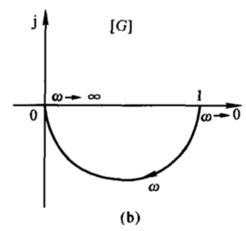


### 3.5一阶复合微分环节

一阶复合微分环节的传递函数为$G(s)=Ts+1$

其频率特性为
$$
\begin{aligned}
G(j \omega) & = T\omega j+1=\sqrt{1+T^2\omega^2} e^{jarctan(T\omega)}	\\
A(\omega)	& = \sqrt{1+T^2\omega^2}		\\
\phi(\omega)& = arctan(T\omega)		\\
\end{aligned}
$$

- $\omega=0$时，$A(\omega)=1$，$\phi(\omega)=0^o$
- $\omega \to \infty$时，$A(\omega) \to \infty$，$\phi(\omega)=90^o$
- 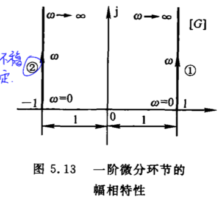

### 3.6二阶振荡环节

二阶振荡环节的传递函数为$G(s)=\frac{\omega_n^2}{s^2+2\xi\omega_ns+\omega_n^2}$

其频率特性为
$$
\begin{aligned}
G(j \omega) & = \frac{1}{(1-\frac{\omega^2}{\omega_n^2})+2\xi\frac{\omega}{\omega_n}j}\\
A(\omega)	& = \frac{1}{\sqrt{{(1-\frac{\omega^2}{\omega_n^2})}^2+4\xi^2 \frac{\omega^2}{\omega_n^2}}}		\\
\phi(\omega)& = -arctan \frac{2\xi\frac{\omega}{\omega_n}}{1-\frac{\omega^2}{\omega_n^2}}		\\
\end{aligned}
$$

- $\omega=0$时，$A(\omega)=1$，$\phi(\omega)=0^o$
- $\omega=\omega_n$时，$A(\omega)=\frac{1}{2\xi}$，$\phi(\omega)=-90^o$
- $\omega \to \infty$时，$A(\omega) \to 0$，$\phi(\omega) \to -180^o$
- 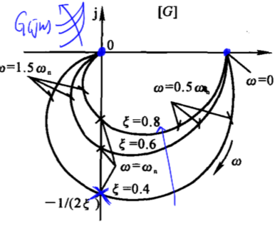

- 幅值$A(\omega)$达到极大值时的$\omega$为谐振频率$\omega_r$，并有谐振峰值$M_r=A(\omega_r)$


### 3.7二阶复合微分环节

二阶复合微分环节的传递函数为$G(s)=T^2s^2+2\xi Ts+1=\frac{s^2}{\omega_n^2}+2\xi \frac{s}{\omega_n}+1$

其频率特性为
$$
\begin{aligned}
G(j \omega) & = (1-\frac{\omega^2}{\omega_n^2})+2\xi\frac{\omega}{\omega_n}j	\\
A(\omega)	& = \sqrt{{(1-\frac{\omega^2}{\omega_n^2})}^2+4\xi^2 \frac{\omega^2}{\omega_n^2}}		\\
\phi(\omega)& = arctan \frac{2\xi\frac{\omega}{\omega_n}}{1-\frac{\omega^2}{\omega_n^2}}		\\
\end{aligned}
$$

- $\omega=0$时，$A(\omega)=1$，$\phi(\omega)=0^o$
- $\omega=\omega_n$时，$A(\omega)=2\xi$，$\phi(\omega)=90^o$
- $\omega \to \infty$时，$A(\omega) \to \infty$，$\phi(\omega) \to 180^o$
- 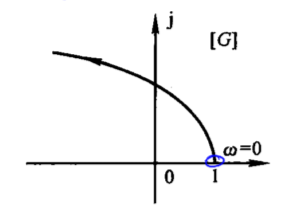

- 幅值$A(\omega)$达到极大值时的$\omega$为谐振频率$\omega_r$，并有谐振峰值$M_r=A(\omega_r)$


### 3.8延迟环节

补充内容：

延迟环节
$$
\begin{aligned}
c(t) = r(t-t_0)		\\

\end{aligned}
$$
根据拉普拉斯变换的实位移定理
$$
L(f(t-t_0))=e^{-t_0s}F(s)
$$
则延迟环节的拉氏变换为
$$
C(s)=e^{-\tau_0s}R(s)
$$
则延迟环节的传递函数为
$$
G(s)=\frac{C(s)}{R(s)}=\frac{e^{-\tau_0s}R(s)}{R(S)}=e^{-\tau_0s}
$$


延迟环节的传递函数为$G(s)=e^{-\tau s}$

频率特性为
$$
\begin{aligned}
G(j\omega) & = e^{-j\tau \omega}	\\
A(\omega)  & = 1					\\
\phi(\omega) & = -\tau \omega		\\
\end{aligned}
$$

- $A(\omega)$始终为1，很好
- $\omega$越大，相角滞后越大

## 4.开环系统幅相特性曲线的绘制

若开环传递函数$G(S)$可由$l$个典型环节串联而成，系统的频率特性为
$$
\begin{aligned}
G(j\omega) & = G_1(j\omega)G_2(j\omega)...G_l(j\omega)		\\
		   & = A_1(\omega)e^{j\phi_1{\omega}}A_2(\omega)e^{j\phi_2{\omega}}...A_l(\omega)e^{j\phi_l{\omega}}		\\
		   & = A(\omega)e^{j\phi(\omega)}	\\
\end{aligned}
$$


其中
$$
A(\omega)=A_1(\omega)A_2(\omega)...A_l(\omega)
$$

$$
\phi(\omega)=\phi_1(\omega)+\phi_2(\omega)+...+\phi_l(\omega)
$$

# 